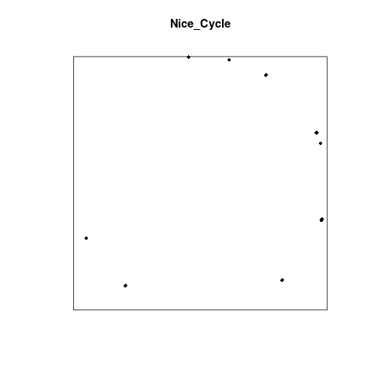

```{r setup, echo = FALSE, message = FALSE}
library(knitr)
```

```{r todos, echo = FALSE}
## TODO: Redefine plot hook so we can have plots inside of html blockquotes
## This get's close, but we need to save file in correct place and
## reference it properly

# knitr::knit_hooks$set(
#   plot = function(x, options) {
#     cap  <- options$fig.cap  # figure caption
#     tags <- htmltools::tags
#     as.character(tags$figure(
#       tags$img(src = x, alt = cap),
#       tags$figcaption(cap)
#     ))
#   }
# )

## A More complicated exampe from knitr's definition:
# knitr::knit_hooks$set(
#   plot = function(x, options) {
#     # pull out all the relevant plot options
#     fig.num = options$fig.num = 1 #options$fig.num knitr::%n% 1L
#     fig.cur = options$fig.cur = 1 # knitr::%n% 1L
#   
#     if (options$fig.show == 'animate') {
#       # Don't print out intermediate plots if we're animating
#       return(if (fig.cur < fig.num) '' else hook_animation(options)(x, options))
#     }
#     ai = options$fig.show == 'asis'
#     plot1 = ai || fig.cur <= 1L; plot2 = ai || fig.cur == fig.num
#     d1 = if (plot1) paste0(if (TRUE) '</div>',
#                           sprintf('<div class="rimage %s">', options$fig.align))
#     d2 = if (plot2) paste0('</div>', if (TRUE) '<div class="rcode">')
#     paste0(
#       "d1, .img.tag(
#         .upload.url(x), options$out.width, options$out.height, .img.cap(options)",
#         paste(c(options$out.extra, 'class="plot"'), collapse = ' '),
#       ")", d2, '\n'
#     )
#   }
# )
#
# One workaround if we can't figure this out is to save images in assets manually and
# include images manually this would be a bit unsatisfying though...
#
### Some General TODOs
## TODO: Need to get Solution to be automatically folded when page loads
## TODO: Add callout, checklist, discussion, prereq and testimonial example blocks
## TODO: fix before text in blocks to be FontAwesome text
## TODO: add example bibliography entry
## TODO: Add some inline references to figures etc.
## TODO: Find somewhere to include author (instructor)
## TODO: Images have a rough style... need softer edges and background color?
```

```{r pkgs, echo = FALSE, message = FALSE}
# Initialize Environment
#########################

# Set CRAN location for installing packages
############################################
r <- getOption("repos")
r["CRAN"] <- "http://cran.wustl.edu"
options(repos = r)
rm(r)

## Helper function to install a CRAN package if not installed and load
######################################################################
use_package <- function(p) {
if (!is.element(p, installed.packages()[,1]))
  install.packages(p, dep = TRUE)
library(p, character.only = TRUE)
}

# Load base R libraries (no need to install)
#############################################
library(grid)

# Check and install CRAN packages (may need more)!!!!!!
#######################################################
use_package('png') # For importing pngs
use_package('grImport2') # For importing svg graphics
use_package('TDA')
use_package('ggplot2') # For some nice plots based in the grid package
```

<blockquote class="objectives">
<h2> Overview </h2>
  <div class="row">
    <div class="col-md-3">
      <strong>Teaching:</strong> 30 min
      <br/>
      <strong>Exercises:</strong> 10 min
    </div>
    <div class="col-md-9">
      <strong>Questions</strong>
      <ul>
	<li><p>What defines meaning? </p>
</li>
	<li><p>Does P = NP? </p>
</li>
	<li><p>Are we alone in the universe?</p>
</li>
      </ul>
    </div>
  </div>
   <div class="row">
    <div class="col-md-3">
    </div>
    <div class="col-md-9">
      <strong>Objectives</strong>
      <ul>
	
	<li><p>Parallel park a train</p>
</li>
	
	<li><p>End world hunger</p>
</li>
	
	<li><p>Develop your very own R package 'TDA'</p>
</li>
      </ul>
    </div>
  </div>
</blockquote>

<!--- the syntax '---' creates a line seperator, a nice way to split up concepts -->

---

## Content
Blibbity blah blah, here is my sweet content, add yours here.


### Subsections
Blibbity blah blah, this is a subsection, make as many or as few as you'd like using increasing numbers of # symbols.

### Subsection with code chunk
Here's how to add a code chunk:

```{r plot_two_Circles, message=FALSE, echo=TRUE}
library('TDA')
library('spatstat')

x <- circleUnif(50,10)
plot(x, pch = 18, xlab = "", ylab = "")
```

Or if we just want plots and not the code that generated them:

```{r plot_two_Circles_Again, message=FALSE, echo=FALSE}
library('TDA')
library('spatstat')
x <- circleUnif(100,1.5)
Nice_Cycle <- as.ppp.data.frame(x,c(-2,2,-2,2))
plot(Nice_Cycle, pch = 18, xlab = "", ylab = "")

xppp <- as.ppp.data.frame(Nice_Cycle,c(-2,2,-2,2))
Angsty_Cycle <-rjitter(xppp,0.25)
plot(Angsty_Cycle, pch = 16, xlab = "", ylab = "")
```

---

### Adding References

For some entirely credible theories about whether we are alone in the universe,
take a look at the important work *Disinformation guide to ancient aliens, lost
civilizations, astonishing archaeology & hidden history* .

### Various Blocks

There are various blockquote classes for given purposes. These include:

 - callout
 - objectives
 - keypoints
 - challenge
 - solution
 - prereq
 - testimonial

Here are the examples not included elsewhere in this documen

<dev>
<blockquote class="callout">
<h2> A Callout block </h2>
      <ul>
	<li><p></p>
</li>
	<li><p></p>
</li>
	<li><p></p> </li>
      </ul>
</blockquote>
</dev>

<dev>
<blockquote class="prereq">
<h2> A Prereq block </h2>
      <ul>
	<li><p>Before you attempt to parallel park a train, you should take a look at
	<a href="https://answers.yahoo.com/question/index?qid=20130819233007AAQhlSA&guccounter=1&guce_referrer=aHR0cHM6Ly9kdWNrZHVja2dvLmNvbS8&guce_referrer_sig=AQAAACdALqOVkl0mLZiW1g8IpTgYvl8G_uts7jSairhAXRofywjM0vkKt_a7-XmXTcYmCACskbMHjfw9QG6BNraV83oqT7nPPODo2fvflxXBGivWO5yPq0I69ySc2PN5dOv_Rth1uuTdLj59oPlFNDbhkKebio8oCIl9yS-dP7JCuy-x"> this yahoo post </a>
	</p>
</li>
	<li><p>Before solving the P equals NP problem, you might want to consider the consequences.</p>
</li>
	<li><p>Have you considered that aliens may already live among us?</p> </li>
      </ul>
</blockquote>
</dev>

<dev>
<blockquote class="testimonial">
<h2> A Testimonial block </h2>
      <ul>
	<li><p></p>
</li>
	<li><p></p>
</li>
	<li><p></p> </li>
      </ul>
</blockquote>
</dev>

blabbidy blah

## Another Section With a Challenge

Yada yada yada, clustering, manifolds

<blockquote class="challenge">
  <h3 id="exploring-more-ls-flags">Challenge</h3>
      <ul>
	<li><p>Create your own cycle with 10 points and radius = 10.</p>
</li>
	<li><p>Make sure that the axes are not labeled with a range of numbers.</p>
</li>
      </ul>

  <blockquote class="solution">
    <h3 id="solution">Solution</h3>
	
```{r plot_one_Circle, message=FALSE, echo=TRUE, fig.keep='none'}
x <- circleUnif(10, 10)
Nice_Cycle <- as.ppp.data.frame(x,c(-10,10,-10,10))
plot(Nice_Cycle, pch = 18, xlab = "", ylab = "")
```

	
```{r plot_one_Circle-save, message=FALSE, echo=FALSE, fig.keep='none', results='hide', warning=FALSE}
dir.create("../../assets/first-draft")
png("../../assets/first-draft/plot_one_Circle.png")
x <- circleUnif(10, 10)
Nice_Cycle <- as.ppp.data.frame(x,c(-10,10,-10,10))
plot(Nice_Cycle, pch = 18, xlab = "", ylab = "")
dev.off()
```

<dev>
	
</dev>

  </blockquote>
</blockquote>

--- 

<dev>
<blockquote class="keypoints">
<h2> Key Points </h2>
      <ul>
	<li><p>The world is what you make it</p>
</li>
	<li><p>P equals NP, but there wasn't enough room to fit the proof in the margins</p>
</li>
	<li><p>Are we're alone in the universe? I think not. As Fox
           Moulder's office poster says: ''I want to believe''</p> </li>
      </ul>
</blockquote>
</dev>

## References



