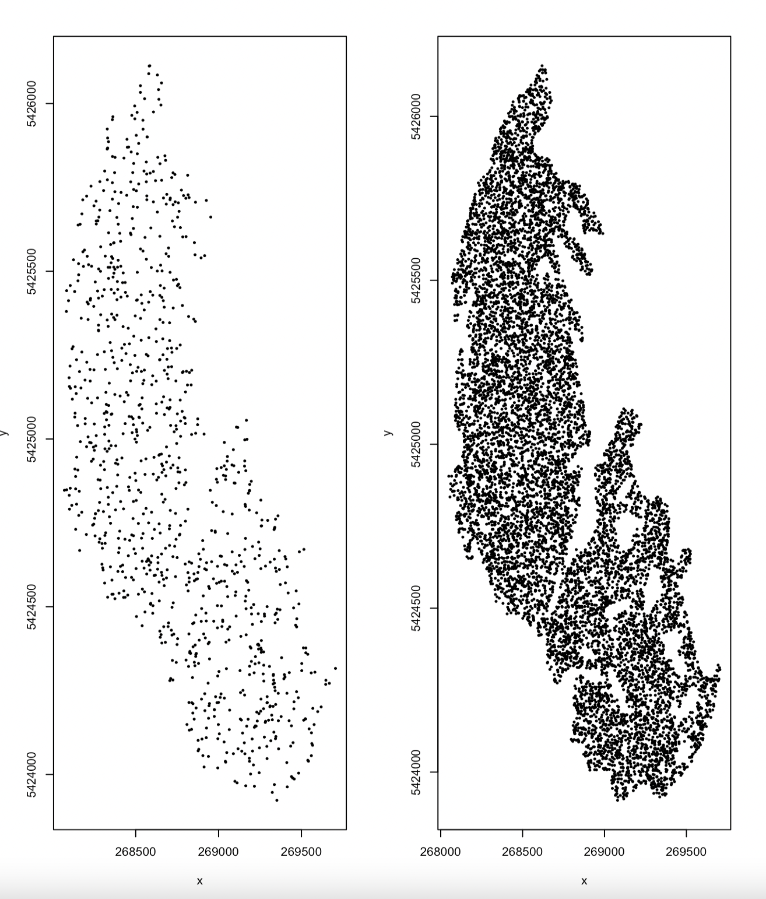

## Overview

After this session, we hope you will take away the following:

### Objectives
- Learn how to read data into R
- Learn basic R functionalities and data structures
- Visualize data with R
- Be able to use R on GIS data
- Understand early stages of the data analysis pipeline, by playing with data
- Prepare GIS data for the topological data analysis pipeline

## Getting Started

Before we really get going with topology and topological data analysis, 
we first need a basic understanding of how to handle data in R.

We will be working with R online in [R Studio Cloud](https://login.rstudio.cloud/),
though if you'd prefer to work in R Studio locally that is fine too. Create an account,
this is probably easiest using your google account, and start working in the `posit cloud`.

Once in your workspace, begin by clicking `new project` and selecting an `RStudio` project.
Name the project whatever you'd like, perhaps something like `R-Intro`.

### Reading data into R


### Fundamental data structures in R

### Fundamental visualizations in R


## Working with GIS Data in R

### Getting Started with GIS Data in R

For this tutorial we will use GIS data from Glacier National Park in Northwestern Montana.
The data can be downloaded from the USGS at [this address](https://www.sciencebase.gov/catalog/item/58af7022e4b01ccd54f9f542).

Let's begin by downloading the data from 1966:


For fun, click around a bit with the data you've downloaded. It is in shapefile format, which can be 
viewed with GIS software. One easy way to do this is with Google Earth. Google Earth Pro is free to 
download, and you import shapefiles (on Mac) with

```
file -> import
```

The glacier data should look something like this:


After gaining some familiarity with the data that we're working with, let's start actually working with
the data in R. Open R Studio, and begin a new R script in your desired location.
Import the R 'Geospatial' Data Abstraction Library (RGDAL), and the Spatial Data library (SP), which we will use to upload and manipulate the shapefiles:

```
library(rgdal)
library(sp)
```

Import the 1966 glacier data using the corresponding `readOGR` method from RGDAL. You must use the 
absolute path of the directory storing the GIS data, and also give the prefix of the data in the layer 
argument. On a Mac, this is:

```
glaciers_66 <- readOGR(dsn = "/Users/you/INSERT YOUR PATH HERE/GNPglaciers_1966",
layer = "GNPglaciers_1966", verbose = FALSE)
```

(Note that the relative path `~/GNPglaciers_1966` won't work for the dsn argument)

View the first glacier you've uploaded using the `head` method:

```
first <- head(county, 1)
first
```

Notice that the data is pretty big! We have uploaded every glacier in GNP, so there's a lot in there.
You can view the first 5 glaciers if you want to get more of a sense of the complexity of our data.

```
first_five <- head(county, 5)
first_five
```

Notice that the fundamental glacier shape data is stored in polygon format.
The standard R command for plotting is carried along with GIS data as well.
Plot the first glacier to visualize it, it should look familiar to what you saw on Google Earth.

```
plot(first)
```


We can also go ahead and view all of the glaciers in GNP in the same way.

```
plot(glaciers_66)
```


Now, we can't do topological data analysis using polygon objects. Rather, we need to somehow obtain a 
point cloud indicative of each glacier. To do this, we can randomly sample 1000 points within each 
polygon using the SP library.

Let's try sampling points within the first glacier.

```
pts <- spsample(first,n=1000,"random")
pts
```

To plot this, we can convert the sampled points to a data frame format, and view the resulting point 
cloud. For ease of visibility, each point will be plotted as a small, filled in circle.

```
X <- as.data.frame(pts)
plot(X, pch=20, cex=.5)
```

Notice that we are starting to see the shape of the first glacier. Let's make a denser point cloud 
by sampling 10000 points instead.

```
pts <- spsample(first,n=10000,"random")
X <- as.data.frame(pts)
plot(X, pch=20, cex=.5)
```




### Preparing Data for the Topological Data Analysis Pipeline

