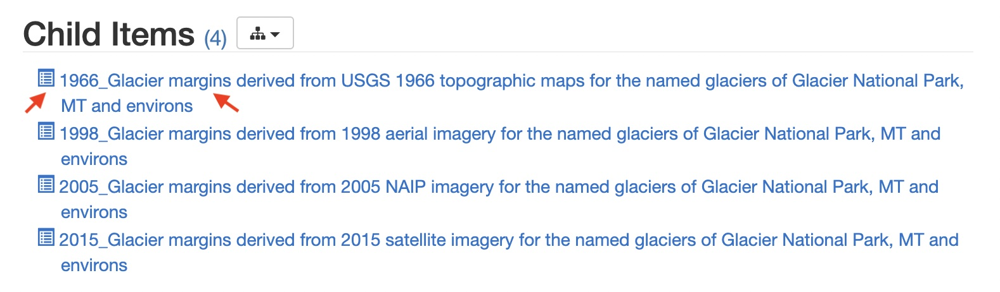
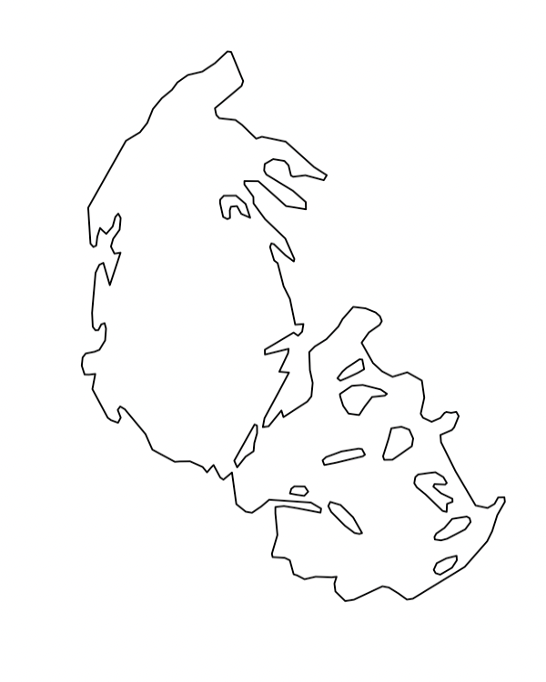
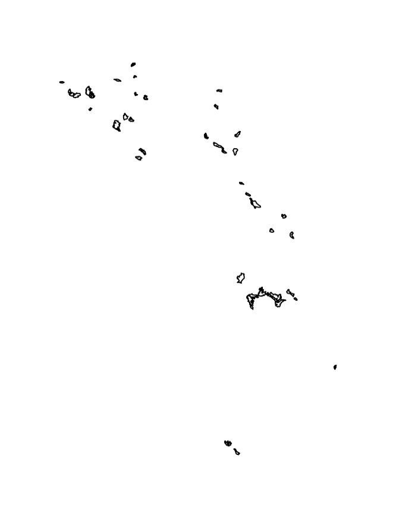

## Overview

In this session, we'll combine the theoretical ideas and simple
R tutorials with an exciting application area in GIS: the changing
shape of glaciers. We will study the differences in shape of the
glaciers in Glacier National Park over time, and compare our findings
to other metrics of glacier health.

This session is co-presented by Brittany and Ben.

### Objectives

After this session, we hope that you will be able to:

> - Use theoretical ideas in topology for domain-specific applications
> - Interpret the changing shape of Montana's glaciers
> - Compare and contrast shape differences with changes in glacial health


## Getting Started with Glacier Data in R

For this tutorial we will use GIS data from Glacier National Park in Northwestern Montana.
The data can be downloaded from the USGS at [this address](https://www.sciencebase.gov/catalog/item/58af7022e4b01ccd54f9f542).

If you have Google Earth Pro installed on your computer (it is free to download), you can
view shapefiles overlayed on Earth. Consider downloading the data locally,
and playing around with it in Google Earth:



Once downloaded, the data can be imported with:

```
file -> import
```

In Google Earth, the glacier data should look something like this:


After (hopefully) gaining some familiarity with the data, let's start actually working with
the data in R. Open R Studio cloud, and create a new R script. Call it something
like, `Glacier-TDA`.
As before, we will use the `RGDAL` and `SP` libraries to upload and manipulate shapefiles:

```
library(rgdal)
library(sp)
```

Import the 1966 glacier data directly from the internet using `download.file` and then `system`
to unzip the .zip file.

```
download.file("https://www.sciencebase.gov/catalog/file/get/58af7532e4b01ccd54f9f5d3?facet=GNPglaciers_1966",destfile = "/cloud/project/Glaciers.zip")
system("unzip /cloud/project/MontanaCounties.zip")
```

Then read in the downloaded `.shp` file using `readOGR`.

```
glaciers1966 <- readOGR(dsn="/cloud/project/GNPglaciers_1966.shp")
```


Try to view the first glacier you've uploaded using the dataframe indexing syntax.

<details>
<summary style="color:red">See the Answer</summary>
<br>
<pre style="background-color:lightcoral">
<code>
glaciers1966[1,]
</code>
</pre>
</details>


Notice that the data is pretty big! Each glacier individually (like the county data
we saw earlier) is
fairly involved. Plus, altogether we have uploaded every glacier in GNP, so there's a lot going on.
Use the `head` command to view the first 5 glaciers if you want to
get more of a sense of the complexity of our data.

<details>
<summary style="color:red">See the Answer</summary>
<br>
<pre style="background-color:lightcoral">
<code>
first_five <- head(glaciers1966, 5)
first_five
</code>
</pre>
</details>


Notice that the fundamental glacier shape data is stored in polygon format,
which is the same as the county GIS data we used before. Try plotting the first
glacier in our dataset.

<details>
<summary style="color:red">See the Answer</summary>
<br>
<pre style="background-color:lightcoral">
<code>
plot(glaciers1966[1,])
</code>
</pre>
</details>





For fun, try viewing all of the glaciers in GNP in the same way.

<details>
<summary style="color:red">See the Answer</summary>
<br>
<pre style="background-color:lightcoral">
<code>
plot(glaciers1966)
</code>
</pre>
</details>




---

### Segmentation of Raw GIS Data

For 5 to 10 minutes, using what you know about filtrations,
discuss amongst yourselves how we might transform our GIS data in order to study its topology.
What options do we have? Could these options introduce error?

---

With the raw glacier data in hand, let's try creating a grid of points lying within the polygon.

We'll start out just with the first glacier in GNP on our list, and then move to a bigger
set of glaciers. As a warmup exercise, see if you can find the
name of `glaciers1966[1,]`, the first glacier in our dataframe.

<details>
<summary style="color:red">See the Answer</summary>
<br>
<pre style="background-color:lightcoral">
<code>
> names(glaciers1966)
 [1] "RECNO"      "X_COORD"    "Y_COORD"    "GLACNAME"   "CLASSIFICA"
 [6] "YEAR"       "SOURCE_SCA" "SOURCE"     "COMMENT"    "Shape_Leng"
[11] "Area1966"   "OWNERSHIP"  "OBJECTID"  
> glaciers1966[1,]$GLACNAME
[1] "Agassiz Glacier"
</code>
</pre>
</details>

Do you remember how to sample within a spatial polygon? Recall from yesterday,
we sampled from within counties in Montana randomly. See if you can sample randomly
1000 points from the Agassiz Glacier, and save this in the `randGlac` variable.

<details>
<summary style="color:red">See the Answer</summary>
<br>
<pre style="background-color:lightcoral">
<code>
randGlac <- spsample(glaciers1966[1,], n=1000,"random")
</code>
</pre>
</details>

Now, let's quickly visualize our random sample:

```
plot(randGlac)
```

<details>
<summary style="color:blue">Expected Output</summary>
<br>
<pre>

</pre>
</details>

As might have arisen in your discussions, we could take a random sample from the
Agassiz glacier. However, this would introduce additional imprecision and randomness to
our data, which we don't necessarily want. A better idea is to get a uniform grid
from within our polygon, and use TDA (namely, a grid filtration) on that.

Let's get sample a uniform grid of 4000 points from within our polygon. Luckily, the `spsample`
function has the option to get a `regular` sample.

```
unifGlac <- spsample(glaciers1966[1,], n=4000, "regular")
```

Indeed, if we plot this we get a clean grid:

```
plot(unifGlac, pch=20, cex=.25)
```

<details>
<summary style="color:blue">Expected Output</summary>
<br>
<pre>

</pre>
</details>


And, we get something nice to do TDA with.
That is, we can do a grid filtration! 
Recall that a grid filtration requires
(1) a grid, and (2) a function on that grid.
One simple way to assign a function to our grid is
by computing the distance from each cell to the boundary.

To do this, we're going to need to compute distance between sets of points.
Given two sets $A, B \subset \mathbb{R}^2$, let $a \in A, b^* \in B$.
For every $a \in A$, `distFcn` computes the Euclidean
distance $d(a, b^*)$, where  $b^*$ is the nearest point to $a$ in $B$.

In our example, what are the sets $A$ and $B$?
We take $A$ to be the grid stored in `unifGlac`, and
$B$ to be the boundary of the polygon `glaciers1966[1,]`.

However, `distFcn` requires two *finite* sets as input.
To represent the glacier boundary as a finite set, we
define a set of points living on the edge of the polygon
in the following helper function.

```
rPointOnPerimeter <- function(n, poly) {
    xy <- poly@coords
    dxy <- diff(xy)
    # hypot depends on the pracma library, make sure it's installed
    h <- hypot(dxy[,"x"], dxy[,"y"])

    e <- sample(nrow(dxy), n,replace=TRUE, prob=h)

    u <- runif(n)
    p <- xy[e,] + u * dxy[e,]

    p
  }
```

This function has one dependency we haven't installed yet, the `pracma` package.
Make sure you install and import it before running the function.

```
install.packages("pracma")
library(pracma)
```

We can now define a set for the boundary by running this helper function
on the polygon representing the Agassiz glacier.

```
poly <- glaciers1966[1,]@polygons[[1]]@Polygons[[1]]
perimeter <- rPointOnPerimeter(10000, poly)
```

Let's see how the helper function worked for us by plotting the result.

```
plot(perimeter)
```

<details>
<summary style="color:blue">Expected Output</summary>
<br>
<pre>

</pre>
</details>


<details>
<summary style="color:DarkOrange">A Note on our Helper Function</summary>
<br>
<pre style="background-color:Gold">
Note that due to varying lengths of edges on the polygon, our simple helper function
does not perfectly compute points along edges. However, in the interest of simplicity,
it should be sufficient.
</pre>
</details>


TODO: Use boundary and grid for distance function, 
TODO: Do filtration
TODO: Compute distances over time

TODO: Compute distances over big data


## Wrapping Up

TODO
