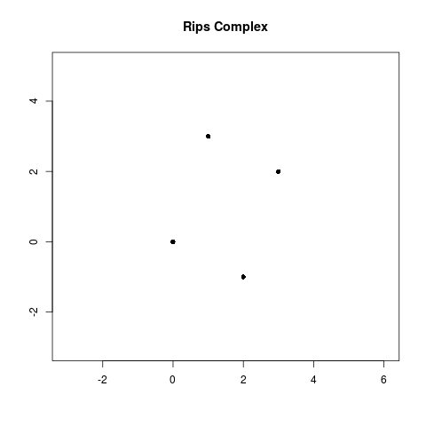




```{r pkgs, echo = FALSE, message = FALSE}
# Initialize Environment
#########################

# Set CRAN location for installing packages
############################################
r <- getOption("repos")
r["CRAN"] <- "http://cran.wustl.edu"
options(repos = r)
rm(r)

## Helper function to install a CRAN package if not installed and load
######################################################################
use_package <- function(p) {
if (!is.element(p, installed.packages()[,1]))
  install.packages(p, dep = TRUE)
library(p, character.only = TRUE)
}

# Load base R libraries (no need to install)
#############################################
library(grid)

# Check and install CRAN packages
##################################
use_package('png') # For importing pngs
use_package('grImport2') # For importing svg graphics
use_package('TDA')
use_package("plotrix")
use_package("animation")
use_package("squash")
use_package("maps")
```


```{r usr_fncs, echo = FALSE}
plot.rips_filt <- function(filt, thresh = 0.2, animate = FALSE, fn_out, lout, ...) {
    data <- filt$coordinates
    two_d_check <- dim(data)[2] == 2
    # euclidean_check <- #TODO: need to pass euclidean distance into filtration object

  plot_fun <- function(filt, r) {
    data <- filt$coordinates
    xlim <- range(data[, 1])
    ylim <- range(data[, 2])
    diff <- 0.1 * (xlim[2] - xlim[1])
    xlim[1] <- xlim[1] - diff
    xlim[2] <- xlim[2] + diff
    diff <- 0.1 * (ylim[2] - ylim[1])
    ylim[1] <- ylim[1] - diff
    ylim[2] <- ylim[2] + diff
    xmin <- min(data[, 1])
    xmax <- max(data[, 1])
    ymin <- min(data[, 2])
    ymax <- max(data[, 2])
    max_dist <- max(dist(data))
    xlims = c(xmin - max_dist / 2, xmax + max_dist / 2)
    ylims = c(ymin - max_dist / 2, ymax + max_dist / 2)
      plot(NULL, type = "n", xlim = xlims, ylim = ylims, main = "Rips Complex",
                xlab = "", ylab = "", asp = 1)
      for(j in 1:length(data[, 1])) {
        draw.circle(x = data[j, 1], y = data[j, 2], radius = r / 2,
        col = rgb(0.1, 0.6, 0.1, 0.05))
      }
      for (idx in seq(along = filt[["cmplx"]][filt$values < r])) {
        polygon(data[filt[["cmplx"]][[idx]], 1], data[filt[["cmplx"]][[idx]], 2],
                col = "pink", border = NA, lwd = 1.5)
      }
      for (idx in seq(along = filt[["cmplx"]][filt$values < r])) {
        polygon(data[filt[["cmplx"]][[idx]], 1], data[filt[["cmplx"]][[idx]], 2],
                col = NULL, lwd = 1.5)
      }
      points(data[,1], data[,2], pch = 16)
 }
  if (!two_d_check) { #todo: add euclidean check w/ && euclidean_check
    stop("Data needs to be 2-d")
  }
  if (animate) {
    saveGIF({
             for (i in seq(0, max(dist(data))*1.1, length.out = lout)){
               plot_fun(filt, r = i)
             }
            },
            movie.name = fn_out, ...)
  } else {
    plot_fun(filt, r = thresh)
  }
}

plot_rips_bigfoot <- function(filt, thresh = 0.2, animate = FALSE, fn_out, lout, ...) {
    data <- filt$coordinates
    two_d_check <- dim(data)[2] == 2
    # euclidean_check <- #TODO: need to pass euclidean distance into filtration object

  plot_fun <- function(filt, r) {
    data <- filt$coordinates
    xlim <- range(data[, 1])
    ylim <- range(data[, 2])
    diff <- 0.1 * (xlim[2] - xlim[1])
    xlim[1] <- xlim[1] - diff
    xlim[2] <- xlim[2] + diff
    diff <- 0.1 * (ylim[2] - ylim[1])
    ylim[1] <- ylim[1] - diff
    ylim[2] <- ylim[2] + diff
    xmin <- min(data[, 1])
    xmax <- max(data[, 1])
    ymin <- min(data[, 2])
    ymax <- max(data[, 2])
    max_dist <- max(dist(data))
    xlims = c(xmin - max_dist / 2, xmax + max_dist / 2)
    ylims = c(ymin - max_dist / 2, ymax + max_dist / 2)
    par(mar = c(0,0,0,0))
    mt_range <- map("state", "Montana", plot = FALSE)$range
    xrange <- diff(mt_range[1:2])
    yrange <- diff(mt_range[3:4])
    plot(NULL, bty = "n",
         xlim = c(mt_range[1] - .1*xrange, mt_range[2] + .1*xrange),
         ylim = c(mt_range[3] - .1 * yrange, mt_range[4] + .1 * yrange), pch=16)
    map("state", region = "Montana", add = TRUE)
#      plot(NULL, type = "n", xlim = xlims, ylim = ylims, main = "Rips Complex",
#                xlab = "", ylab = "", asp = 1)

      for(j in 1:length(data[, 1])) {
        draw.circle(x = data[j, 1], y = data[j, 2], radius = r / 2,
        col = rgb(0.1, 0.6, 0.1, 0.05))
      }
      for (idx in seq(along = filt[["cmplx"]][filt$values < r])) {
        polygon(data[filt[["cmplx"]][[idx]], 1], data[filt[["cmplx"]][[idx]], 2],
                col = "pink", border = NA, lwd = 1.5)
      }
      for (idx in seq(along = filt[["cmplx"]][filt$values < r])) {
        polygon(data[filt[["cmplx"]][[idx]], 1], data[filt[["cmplx"]][[idx]], 2],
                col = NULL, lwd = 1.5)
      }
      points(data[,1], data[,2], pch = 16)
 }
  if (!two_d_check) { #todo: add euclidean check w/ && euclidean_check
    stop("Data needs to be 2-d")
  }
  if (animate) {
    saveGIF({
             for (i in seq(0, max(filt$values)*1.1, length.out = lout)){
               plot_fun(filt, r = i)
             }
            },
            movie.name = fn_out, ...)
  } else {
    plot_fun(filt, r = thresh)
  }
}

```
## Introduction

Suppose we are given a finite set, $$S$$, of points in $$\mathbb{R}^n$$. The set of
points is topologically uninteresting. How can we fix this? Yes, you guessed it: we
can construct a Vietoris Rips (Rips) complex from the points in $$S$$! The Rips Filtration is
a specific nested sequence of Rips complexes over $$S$$. Both provide geometric and topological
information about our point set. In this tutorial, we explore this idea and how a Rips complex and
filtration can be used to better understand data sets.

## Objectives

By the end of this tutorial you should be able to:

* Define Abstract Simplicial Complexes.
* Compute a Rips complex and Rips filtration from a finite set of points in
$$\mathbb{R}^n$$ by hand.
* Compute a Rips Filtration from a finite set of points in $$\mathbb{R}^n$$ using the R-TDA package.
* Name a few applications of the Rips complexes and filtrations.


## Theory


First, we breifly describe the mathematical foundations behind a Rips Filtration including
abstract simplicial complexes, filtrations, and the Rips complex. *Computation Topology: An Introduction*
provides more details on the theory .

### Triangle Appreciation

We construct a Rips complex from simplices of varying dimensions that are generalizations of triangles
of varying dimensions. More specifically, an *n-simplex* is the smallest convex set of $$n-1$$ points,
$$v_0,...,v_{n-1}$$ where $$v_1-v_0,...,v_{n-1}-v_0$$ are linearly independent.

<center>
<embed width="70%" src="../../assets/tda-rips/simplices.svg" type="image/svg+xml" />
</center>

An *abstract simplicial complex* is a finite collection of sets, $$A$$, that is closed under the subset
relation, i.e., if $$a\in A$$ and $$b\subset a$$, then $$b\in A$$. The elements $$a\in A$$ are the
simplices where dim$$(a):=$$card$$(a)-1$$. Here, card$$(a)$$ is the number of points in the set, $$a$$.

<center>
<embed width="80%" src="../../assets/tda-rips/asc.svg" type="image/svg+xml" />
</center>


### Rips Complex

Let $$S$$ be finite set of points in $$\mathbb{R}^n$$. Let $$r\geq 0$$. The Rips complex of $$S$$
and $$r$$ is the abstract simplicial complex of $$\text{VR}(S, r)$$ consisting of all subsets
of diameter at most $$r$$:

$$ \text{VR}(S, r):=\{\sigma\subset S \mid \text{ diam}(\sigma)\leq r\} $$

where the *diameter* of a set of points is the maximum distance between any two points in the set.

Geometrically, we can constuct the Rips complex by considering balls of radius $$\frac{r}{2}$$,
centered at each point in $$S$$. Whenever $$d$$ balls have pairwise intersections, we add a $$d-1$$
dimensional simplex. For this tutorial, we use the standard Euclidean distance (unless stated otherwise)
to compute a Rips complex.

You may be familiar with *contact graphs* where the vertices represent a geometric object such as a
circle, curve, or polygon, and an edge between two vertices exists if the corresponding two objects
intersect. The Rips complex is a generalization of contact graphs.

Here are some examples of Rips complexes:

<center>
<embed width="80%" src="../../assets/tda-rips/ripscomplex.svg" type="image/svg+xml" />
</center>

**Note:** Many people also define $$\text{VR}(S, r) :=\{\sigma\subset S \mid \text{diam}(\sigma)\leq 2r\}$$. However, the algorithms used in the R-TDA package use the first definition.

### Filtrations

A *filtration* of a simplicial complex, $$K$$, is a nested sequence of subcomplexes starting at the
empty set and ending with the full simplicial complex, i.e.,

$$\emptyset \subset K_0 \subset K_1 \subset ... \subset K_n=K.$$

Going back to the Rips complex, we consider $$r$$ to be a free parameter. If we vary $$r$$, we
get different Rips complexes. In many data analysis situations, the value of $$r$$ that best describes
the data is unknown or does not exist, so why not look at all of them!? Observe if we increase $$r$$
continuously, then we get a family of nested Rips complexes; the *Rips filtration*.

Let's work through an example. Let $$S:=\{(0,0),(1,3),(2,-1),(3,2)\}\subset \mathbb{R}^2$$. We
want to compute a Rips filtration on $$S$$ for all $$r\geq 0$$.

<center>
<embed width="90%" src="../../assets/tda-rips/ripsfilt.svg" type="image/svg+xml" />
</center>

Observe:

* When $$r<\sqrt{5}$$, none of the balls of radius $$\frac{r}{2}$$ intersect and so $$\text{VR}(S,r$$) is
four points.
* When $$r=\sqrt{5}$$, the balls of radius $$\frac{\sqrt{5}}{2}$$ centered at $$(0,0)$$ and
$$(2,-1)$$ intersect which means we add a 1-simplex between $$(0,0)$$ and $$(2,-1)$$. Similarly,
we add a 1-simplex between $$(1,3)$$ and $$(3,2)$$.
* When $$r\in (\sqrt{5},\sqrt{10})$$, no additional balls of radius $$\frac{r}{2}$$ intersect which means $$\text{VR}(S, r)=\text{VR}(S, \sqrt{5}$$).
* When $$r=\sqrt{10}$$, we add a two more 1-simplices between $$(0,0), (1,3)$$, and $$(2,-1),
(3,2)$$.
* When $$r \in (\sqrt{10},\sqrt{13})$$, $$\text{VR}(S,r)=\text{VR}(S, \sqrt{10}).$$
* When $$r=\sqrt{13}$$, we add two 2-simplices between $$(0,0),(1,3),(2,-1)$$ and
$$(1,3),(2,-1),(3,2)$$.
* When $$r \in (\sqrt{13},\sqrt{17})$$, $$\text{VR}(S,r)=\text{VR}(S, \sqrt{13}).$$
* When $$r=\sqrt{17}$$, we add a 3-simplex.
* When $$r>\sqrt{17}$$, $$\text{VR}(S,r)=\text{VR}(S, \sqrt{17}).$$

## Applications of Rips Complexes and Filtrations


Now that we have discussed the theory, let's talk about some of the applications! A Rips
filtration is used on point cloud data or more generally on a data set where there is some notion of distance between all data points. A common form of these types of data are location data.
For example, coordinates of galaxies in the Universe and GPS coordinates of airports on Earth.

The Rips complex provides information on how close the data points are to each other.
Furthermore, the holes in the complex can provide information on where data are not present.
Lastly, the topological information given by taking a Rips filtration can be studied using
persistent homology (tutorial to come soon!).

Another application is studying coverage in sensor networks. The problem is to look at a set
of sensors and find how much coverage the sensors provide.  Robert Ghrist and Vin de Silva
studied this problem using Rips complexes since the complex can be determined easily from
pairwise communication data .

Furthermore, Rips complexes can be used in shape reconstruction. Dominque Attali, Andre Lieutier,
and David Salinas proved that the Rips complex of a point cloud, $$S$$, at some threshold has
the same homotopy type as the union of balls centered around each point in $$S$$ with radius
$$\frac{r}{2}$$  . Rips complexes are nice to use for shape reconstruction
since they do not favor a specific type of alignment of the input.

These are just a few of the applications. There are many more!

## Computing the Rips Filtration using the R-TDA Package


### Toy Example
First, let's go back to the example where $$S=\{(0,0),(1,3),(2,-1),(3,2)\}$$. We compute the Rips
filtration using the R-TDA package.

```{r dataset, echo = TRUE, message = TRUE}
library(TDA) # upload TDA package

S <- cbind(c(0,1,2,3),c(0,3,-1,2)) # write S into R

# Compute Rips Filtration. maxdimension is max dim of homological features 
# to be computed, maxscale is the filtration limit.
RipsFilt <- ripsFiltration(S, maxdimension = 2, maxscale = 5, 
                             dist = "euclidean")
```

Great! So how do we interpret the RipsFilt object?

The ripsFiltration function returns a list:

* **complx** is a list where the $$i^{th}$$ element is a vector of the vertices for the $$i^{th}$$ simplex.
* **values** is a vector where the $$i^{th}$$ entry is the filtration value for the $$i^{th}$$ simplex.
* **increasing**  is a logical variable that states TRUE if the filtration values in the values vector are in increasing order and FALSE if the filtration values are in decreasing order.
* **coordinates** is a matrix representing the coordinates of the vertices. The $$i^{th}$$ row is the coordinate for the $$i^{th}$$ vertex. Note the coordinates matrix appears only if the Euclidean distance is used.

See the documentation for this function with this [link](https://rdrr.io/cran/TDA/man/ripsFiltration.html).
Let's check this out.

```{r output, echo = TRUE, message = TRUE}

RipsFilt$cmplx[[10]] #Access vertices for the 10th simplex in the list
```

Our output tells us that we have a 2-simplex on vertices $$(0,0),(1,3),(3,2)$$. Let's see at which filtration value this appears.

```{r output2, echo = TRUE, message = TRUE}
RipsFilt$values[10] #Access filtration value for the 10th simplex in the list
```

So we have a 2-simplex when $$r=\sqrt{13}$$. We also found this by hand! Accessing the other complex and filtration value elements verifies the rest of the filtration computation we did earlier.

If we want to see an animation of the Rips filtration, we can run the following code with a plot function. This function has input arguments:

* **filt** is the Rips filtration object. (So, Ripsfilt from above)
* **animate** is a logical variable stating TRUE if you want an animation of the filtration or FALSE if you do not want an animation.
* **thresh**  is the threshold value for the Rips complex that will be plotted if animate = FALSE.
* **fn_out**  is the name of the file for the animation if animate = TRUE.
* **l_out**  is the number of levels of radii used in the animation between 0 and 1.1 times the max distance between any two points if animate = TRUE.

Note this function only works if the data set is two dimensional and the Euclidean distance is used.


```{r visualization_echo, echo = TRUE, message = FALSE, results='hide', eval = FALSE, fig.keep = 'none'}

library(plotrix) # packages for plot function
library(animation)

class(RipsFilt) <- c(class(RipsFilt), "rips_filt")

plot(RipsFilt, animate = TRUE, fn_out = 'rips_example.gif',
     lout = 80, interval = 0.2)

```


<center>

</center>

Furthermore, we can look at the Rips complex at a threshold of $$\sqrt{14}$$, by adding the argument, thresh = $$\sqrt{14}$$ and changing animate = FALSE to animate = TRUE.

```{r toyex_complex, echo = TRUE, message = FALSE, results = 'hide', eval = FALSE, fig.keep = 'none'}

plot(RipsFilt, thresh = sqrt(14), animate = FALSE)

```

<center>
<embed width="80%" src="../../assets/tda-rips/toycomplexx.svg" type="image/svg+xml" />
</center>

### Non-Euclidean Distance Example
Now we compute a Rips filtration on $$S$$, but this time using the Manhattan distance or $$\ell_1$$ norm. Recall, that for points, $$\textbf{x}=(x_1,...,x_n)$$ and $$\textbf{y}=(y_1,...,y_n)\in \mathbb{R}^n$$,
the Manhattan distance, $$d_1(\textbf{x},\textbf{y})$$ is defined as:

$$d_1(\textbf{x},\textbf{y}):=\sum_{i=1}^{n}|x_i-y_i|.$$

In order to compute the Rips filtration on $$(S, d_1)$$, we need to create a distance
matrix in R. We can do this using the following code:

```{r distance, echo = TRUE, message = TRUE}
DistMatrix <- dist(S, method = "manhattan", diag = TRUE, upper = TRUE, p = 2)
```

When we use the ripsFiltration function, we write DistMatrix as the first argument instead of $$S$$.
Additionally, the fourth argument will change to dist = "arbitrary" to indicate that we are giving our
own distance metric.

```{r rips_manhattan, echo = TRUE, message = TRUE}

RipsFiltManhattan <- ripsFiltration(DistMatrix, maxdimension = 2,
                                       maxscale = 5, dist = "arbitrary")
```

This time when we compute the Rips complex with $$r=\sqrt{14}$$, we get the following complex:

```{r visualization2_show, echo = TRUE, message = FALSE, results='hide', eval = FALSE, fig.keep = 'none'}

library(squash) # package for drawing diamonds

lim <- rep(c(-3, 5), 2)
plot(NULL, type = "n", xlim = lim[1:2], ylim = lim[3:4],
     main = "Rips Complex with Manhattan Distance for r = sqrt(14)",
     xlab = "", ylab = "")
for(j in 1:length(S[, 1])) {
  diamond(x = S[j, 1], y = S[j, 2], radius = sqrt(14) / 2, col = rgb(0.1, 0.6, 0.1, 0.05))
}
for (idx in seq(along = RipsFiltManhattan[["cmplx"]][RipsFiltManhattan$values < sqrt(14)])) {
  polygon(S[RipsFiltManhattan[["cmplx"]][[idx]], , drop = FALSE],
          col = "pink", border = NA, xlim = lim[1:2], ylim = lim[3:4])
}
for (idx in seq(along = RipsFiltManhattan[["cmplx"]][RipsFiltManhattan$values < sqrt(14)])) {
  polygon(S[RipsFiltManhattan[["cmplx"]][[idx]], , drop = FALSE],
          col = NULL, xlim = lim[1:2], ylim = lim[3:4])
}
points(S, pch = 16)
```

<center>
<embed width="80%" src="../../assets/tda-rips/manhattan.svg" type="image/svg+xml" />
</center>

Hence $$\text{VR}(S, \sqrt{14})$$ with the Manhattan distance is a simplicial complex with two edges, while with the Euclidean distance is a simplicial complex with two 2-simplices.

### Sightings of Bigfoot in Montana
Lastly, we work through an example with real data! The Bigfoot Field Researchers Organization (BFRO) is the only scientific research organization studying the Bigfoot/Sasquatch mystery. They publically provide all Bigfoot sighting reports on their [website](http://www.bfro.net/). We will compute the Rips filtration for Bigfoot sightings in Montana with the hope of finding the where Bigfoot is and is not roaming. Finding the deadzones where Bigfoot is not present could help keep hikers safe from potential encounters. 

```{r bigfootdataset, echo = TRUE, message = TRUE}

#Latitude coordinates of Bigfoot sightings in MT
latitude <- c(45.31278,46.05292,45.97540,47.62167,48.03278,47.70667,
              46.02962,47.66724,46.01833,46.97694,46.76389,45.12266,
              48.27011,46.76472,46.18694,48.36139,45.22417,47.60413,
              47.17833,45.28074,46.48392,47.57549,45.79220,45.61331,
              48.68000,46.30766,47.07444,47.04333,47.07954,46.83285,
              47.12808,46.59692,47.03222,47.06032,46.75889,46.96508,
              46.52520,45.66722,45.82285,45.02620,45.37050)

#Longitude coordinates of Bigfoot sightings in MT
longitude <- c(-109.64490,-112.57100,-112.45540,-115.39030,-105.86420,
               -104.19220,-113.11980,-108.68730,-110.33080,-113.83810,
               -110.77810,-111.56300,-115.64180,-111.88610,-113.69250,
               -113.12360,-111.12500,-113.75930,-111.97440,-109.55280,
               -111.26440,-114.2650,-111.36370,-110.78970,-113.82000,
               -113.14240,-111.96250,-112.70310,-112.56490,-112.70200,
               -111.90940,-110.62680,-114.09060,-114.07170,-114.08000,
               -114.07250,-113.59110,-110.80690,-114.01250,-106.83310,
               -112.97070)

#GPS coordinates of Bigfoot sightings in MT
BigfootSightingsMT <- cbind(longitude, latitude)

```

We can plot the data using the following code.

```{r bigfootdataplot_show, echo = TRUE, message = FALSE, results='hide', eval = FALSE, fig.keep = 'none'}
mt_range <- map("state", "Montana", plot = FALSE)$range
xrange <- diff(mt_range[1:2])
yrange <- diff(mt_range[3:4])
plot(BigfootSightingsMT[,1],BigfootSightingsMT[,2], xlab = "Latitude",
     ylab = "Longitude", main = "GPS coordinates of Bigfoot sightings
     in Montana", xlim = c(mt_range[1] - .1*xrange, mt_range[2] + .1*xrange),
     ylim = c(mt_range[3] - .1 * yrange, mt_range[4] + .1 * yrange), pch=16)
map("state", "Montana", add = TRUE)
```

```{r bigfootdataplot_hide, echo = FALSE, message = FALSE, results = 'hide'}
mt_range <- map("state", "Montana", plot = FALSE)$range
xrange <- diff(mt_range[1:2])
yrange <- diff(mt_range[3:4])
svg('../../assets/tda-rips/bigfoot.svg', height = 7, width = xrange/yrange*5)
plot(BigfootSightingsMT[,1],BigfootSightingsMT[,2], xlab = "Latitude",
     ylab = "Longitude", main = "GPS coordinates of Bigfoot sightings
     in Montana", xlim = c(mt_range[1] - .1*xrange, mt_range[2] + .1*xrange),
     ylim = c(mt_range[3] - .1 * yrange, mt_range[4] + .1 * yrange), pch=16)
map("state", "Montana", add = TRUE)
```

<center>
<embed width="100%" src="../../assets/tda-rips/bigfoot.svg" type="image/svg+xml" />
</center>

Now, let's compute the filtration and visualize it with an animation. In order to speed up the computation, we will set maxscale = 2.5 and maxdimension = 3.

```{r bigfootfiltration, echo = TRUE, message = FALSE, results = 'hide', eval = FALSE, fig.keep = 'none'}

BigfootRipsFilt <- ripsFiltration(BigfootSightingsMT, maxdimension = 3,
                                  maxscale = 1.5, dist = "euclidean")

class(BigfootRipsFilt) <- c(class(BigfootRipsFilt), "rips_filt")

plot_rips_bigfoot(BigfootRipsFilt, animate = TRUE, fn_out = 'bigfoot.gif',
     lout = 120, interval = 0.3, ani.height = 240, ani.width = 240*2)

```

<center>
<embed width="80%" height="auto" src="../../assets/tda-rips/bigfoot.gif"/>
</center>

Furthermore, we can look at the Rips complex at a threshold of 0.8. 

```{r bigfootcomplex, echo = TRUE, message = FALSE, results = 'hide', eval = FALSE, fig.keep = 'none'}

plot_rips_bigfoot(BigfootRipsFilt, thresh = 0.8, animate = FALSE)

```


```{r bigfootcomplex_hide, echo = FALSE, message = FALSE, results = 'hide', eval = FALSE, fig.keep = 'none'}
svg('../../assets/tda-rips/bigfootcomplex1.svg', height = 5, width = 10)
plot_rips_bigfoot(BigfootRipsFilt, thresh = 0.8, animate = FALSE)
dev.off()
```


<center>
<embed width="80%" src="../../assets/tda-rips/bigfootcomplex1.svg" type="image/svg+xml" />
</center>

As we watch the animation, we see that the Rips filtration captures geometric properties about the data set since simplices quickly arise in the filtraion in the locations that reported the most bigfoot sightings. Furthermore, we see the filtration also reveals some topological information about the data set. In particular, at a filtration value of 0.698812, five edges that form a cycle appear around the GPS coordinate (-111, 46). Furthermore, this cycle persists until the filtration value of 0.94698369. Considering the amount of land that is covered in 1 longitude/latitude unit, this cycle could tell us something meaningful about our data. Perhaps this hole is a deadzone where Bigfoot has yet to be found, or maybe this area is inaccessible to humans and that is why there has not been sightings. Regardless of the answer, this cycle provides us guidance for the next step to take to solve the Bigfoot mystery!


## References




